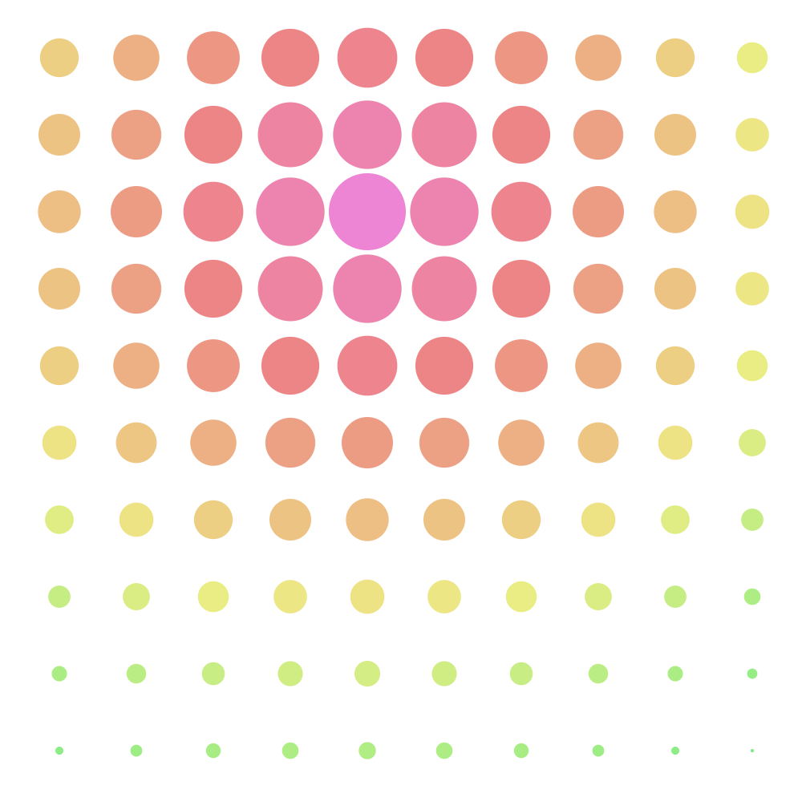
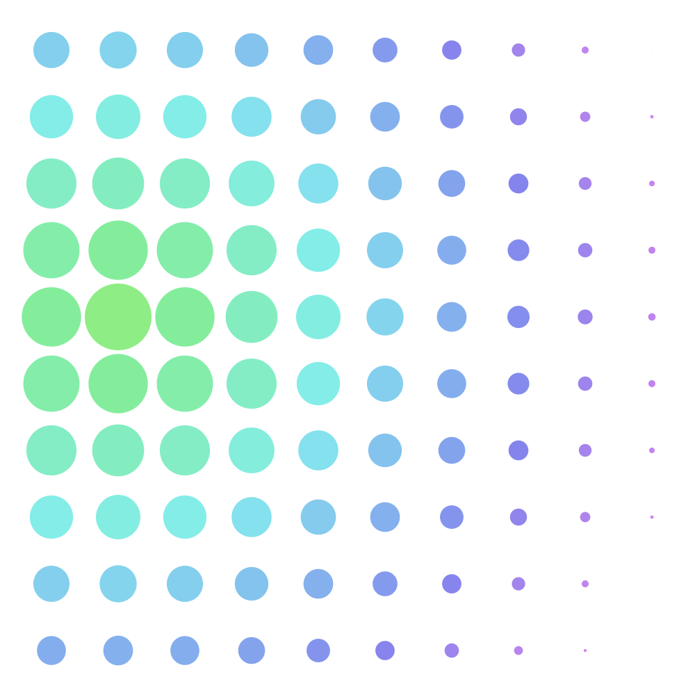
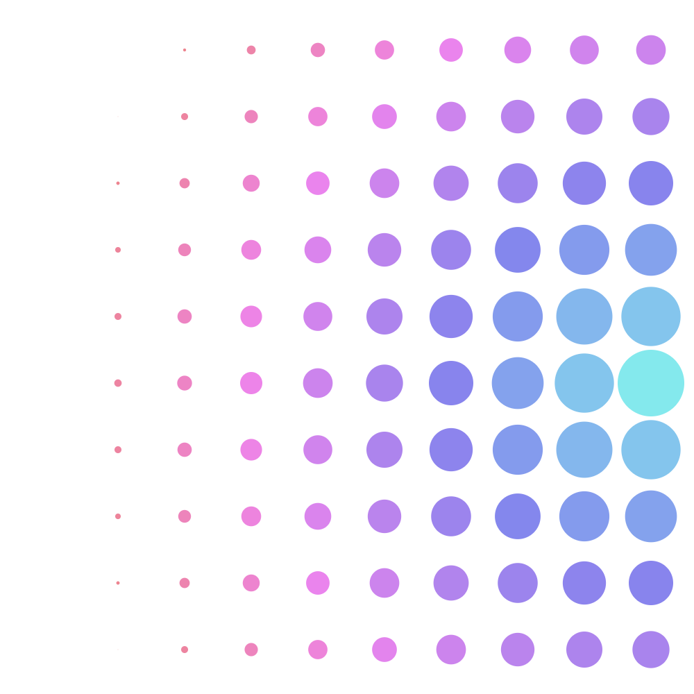

# Generate2 - Topographical Generative Art

### Iain Sandison

The aim of this project was simply to create some generative art from a simple (CSS Grid) array of coloured circles. The colours of the circles are all dependant on a random palette origin colour and then adjusted based off of the same value defining their Scale() property (itself defined by the distance of the item from the randomly chosen "main" circle).

All code has been written in two .php and .css files.

Below are some examples of the images produced:

I may down the line also allow for the image to be affected by the user agent, using some JavaScript to make the project dynamic on the frontend.

